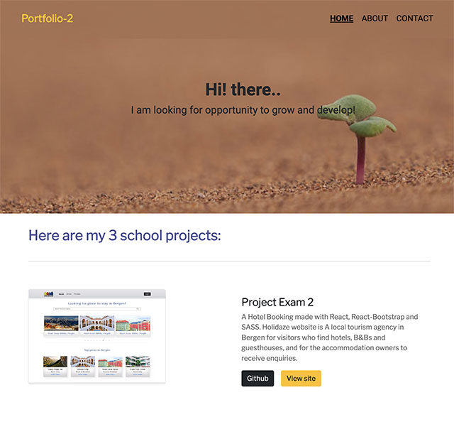

# Web Portfolio 2



## Description

To create a portfolio webpage that lists 3 projects from my school project

-   Semester Project 2
-   JavaScript Frameworks CA
-   Project Exam 2

## Built With

-   [Next.js](https://nextjs.org/docs/getting-started)
-   [React.js](https://reactjs.org/)
-   [React- Bootstrap](https://react-bootstrap.github.io/)

## Getting Started

### Installing

1. Clone the repo:

```bash
git clone https://github.com/nunsinee/webportfolio-2.git
```

2. Install the dependencies:

```
yarn install
```

### Running

To run the app, run the following commands:

```bash
npx next dev
```

## Release

[https://webportfolio-2.vercel.app/](https://webportfolio-2.vercel.app/)
